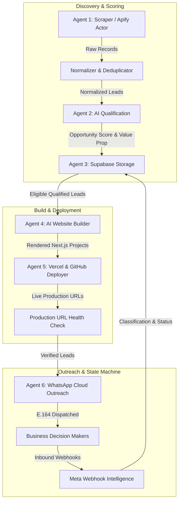

# VASAW AI — System Architecture & Engineering Reference

## 1. High-Level System Architecture

VASAW AI is an autonomous, multi-agent growth engine that discovers local businesses, evaluates their digital presence with AI, generates luxury high-converting websites, deploys them to production, and manages personalized WhatsApp outreach campaigns.

---

## 2. Six-Agent Autonomous Pipeline

| Agent | Responsibility | Core Providers | Output Contract |
| :--- | :--- | :--- | :--- |
| **Agent 1: Scraper** | Discovers Google Maps businesses, sanitizes contact details, normalizes phones to E.164, and deduplicates. | Apify Google Maps Actor / Local Mock Fixtures | `Lead[]` with rating, review count, phone, address, and category |
| **Agent 2: AI Qualification** | Analyzes digital presence gaps, scores opportunities (0–100), and generates customized pitch strategies. | Gemini 2.0 Flash / Groq / NVIDIA Nemotron / Rule Engine Fallback | `QualificationResult` with opportunity score, factors, and notes |
| **Agent 3: Storage & State** | Manages persistent PostgreSQL storage, enforces multi-tenancy RLS, and maintains state machine transitions. | Supabase PostgreSQL Client / PostgREST RPC | `SavedLead`, `Campaign`, `Activity` records with idempotency |
| **Agent 4: Website Builder** | Generates luxury, responsive Next.js 16 landing pages with interactive tabs, booking modals, and floating chat. | Custom Next.js Template Engine / Dynamic SVG Generator | `WebsiteBuildResult` with project directory and bundle artifact |
| **Agent 5: Deployment** | Provisions GitHub repos and deploys projects to Vercel production edge servers. | Vercel REST API / GitHub Octokit / Local Mock Deployer | `DeploymentResult` with live preview/production URLs |
| **Agent 6: WhatsApp Outreach** | Previews, tests, and dispatches personalized WhatsApp outreach messages with safety modes. | Meta WhatsApp Cloud API / Mock Sandbox Provider | `WhatsAppMessageResult` with delivery status and message IDs |

---

## 3. Operational & Safety Modes

VASAW AI enforces strict execution boundaries configured via environment variables:

### A. Application Integration Mode (`APP_INTEGRATION_MODE`)
- `mock` *(Default)*: Runs end-to-end pipelines against fast, deterministic in-memory fixtures and sandboxed databases.
- `live`: Connects to live production services (Apify, Supabase, Gemini, Vercel, Meta).

### B. WhatsApp Outreach Mode (`OUTREACH_MODE`)
- `disabled` *(Default)*: Prepares outbound messages in `PENDING` status with zero external network dispatches.
- `mock`: Simulates successful delivery with generated `mock-wa-*` identifiers.
- `live`: Dispatches real HTTPS requests to Meta Graph API (`https://graph.facebook.com/v21.0/...`).

---

## 4. Database Schema & RPC Functions

### Database Tables:
1. `campaigns`: Tracks multi-batch execution, target metrics, and automation parameters.
2. `leads`: Canonical business records with category, contact information, AI scores, and pipeline status flags.
3. `websites`: Generated single-page web applications with theme configuration and template metadata.
4. `deployments`: Hosting records linking websites to Vercel/GitHub deployments.
5. `messages`: Outbound and inbound WhatsApp message logs with webhook status updates.
6. `activities`: Immutable event stream recording actions across all 6 agents.

### RPC Functions:
- `upsert_lead`: Idempotently inserts or updates lead records using a priority deduplication waterfall (Phone → Normalized Website → Source Place ID → Name + Location).
- `update_lead_status`: Validates state machine transitions before updating lead lifecycle flags.
- `log_provider_attempt`: Telemetry logging for AI, Scraper, and WhatsApp provider latency and error classification.

---

## 5. Security & Secret Protection Standards

1. **Zero Secret Leakage**: API tokens, private keys, and webhook secrets are strictly accessed via server-side environment variables and never exposed to the client or console logs.
2. **Path Traversal Protection**: Website generator validates and enforces that all project directories resolve within safe base boundaries.
3. **HMAC Webhook Verification**: Meta WhatsApp webhooks are validated using `X-Hub-Signature-256` SHA-256 HMAC verification.
4. **Tenant Isolation**: Row Level Security (RLS) policies on Supabase ensure cross-tenant data isolation.
