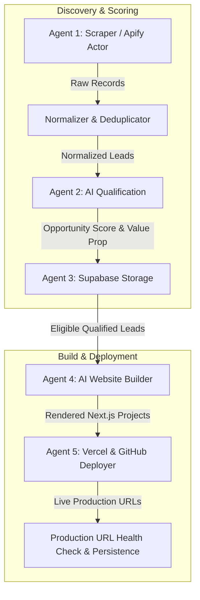

# VASAW AI — System Architecture & Engineering Reference

## 1. High-Level System Architecture: Agents 1 to 5 Foundation Pipeline

VASAW AI is an autonomous, multi-agent growth engine. The core foundation pipeline executes sequentially across Agents 1 to 5:

```
[Agent 1: Scraping]
       ↓ (Normalized Lead)
[Agent 2: Qualification / Gemini]
       ↓ (Qualification Result with 0-100 Score & Priority)
[Agent 3: Supabase Storage]
       ↓ (Persistent Lead & Qualification Records)
[Agent 4: Website Builder]
       ↓ (Rendered Next.js Landing Page Project Artifact)
[Agent 5: Deployment Engine]
       ↓ (Vercel Production Edge Deployment)
[Verified Live URL & Deployed Status Persisted in Database]
```



---

## 2. Five-Agent Autonomous Pipeline Matrix

| Agent | Responsibility | Core Providers | Output Contract |
| :--- | :--- | :--- | :--- |
| **Agent 1: Scraper** | Discovers Google Maps businesses, sanitizes contact details, normalizes phones to E.164, and deduplicates. | Apify Google Maps Actor / Local Mock Fixtures | `Lead[]` with rating, review count, phone, address, and category |
| **Agent 2: AI Qualification** | Analyzes digital presence gaps, scores opportunities (0–100), and generates customized pitch strategies. | Gemini 2.0 Flash / Groq / NVIDIA Nemotron / Rule Engine Fallback | `QualificationResult` with opportunity score, factors, and notes |
| **Agent 3: Storage & State** | Manages persistent PostgreSQL storage, enforces multi-tenancy RLS, and maintains state machine transitions. | Supabase PostgreSQL Client / PostgREST RPC | `SavedLead`, `Campaign`, `Activity` records with idempotency |
| **Agent 4: Website Builder** | Generates luxury, responsive Next.js landing pages with interactive tabs, booking modals, and floating chat. | Custom Next.js Template Engine / Dynamic SVG Generator | `WebsiteBuildResult` with project directory and bundle artifact |
| **Agent 5: Deployment** | Provisions GitHub repos and deploys projects to Vercel production edge servers with live URL verification. | Vercel REST API / GitHub Octokit / Local Mock Deployer | `DeploymentResult` with live verified URLs & deployment state |

---

## 3. Strict Public / Private Data Boundary

To safeguard internal proprietary intelligence and avoid leaking qualification notes to prospective clients, VASAW AI enforces a strict architectural boundary:

### Private Internal Layer (Agents 1–3)
- Opportunity scores (0–100)
- Qualification priority (`high`, `medium`, `low`)
- AI reasoning notes & confidence percentages
- Raw qualification factor scores
- Lead opportunity requirements

### Public Customer-Facing Layer (Agent 4 & 5)
- `PublicBusinessProfile` (Business Name, Category, City, Address, Phone, Rating, Reviews, Menu/Services)
- Generated luxury landing page copy
- Interactive booking modals and WhatsApp links
- Verified Google review quotes (factual, un-fabricated)

---

## 4. State Machine Progression

The campaign and lead state machine progresses through deterministic phases:

```
[SCRAPED] → [QUALIFIED] → [WEBSITE_BUILDING] → [WEBSITE_READY] → [DEPLOYING] → [WEBSITE_DEPLOYED]
     ↓            ↓               ↓                                   ↓               ↓
 [REJECTED]  [DISQUALIFIED] [QUALITY_FAILED]                   [BUILD_FAILED]  [DEPLOY_FAILED]
```

---

## 5. Security & Redaction Standards

All API endpoints, orchestrator runners, deployment providers, and logging utilities pass through `sanitizeErrorMessage` and `sanitizeOrchestrationError`. Token patterns (Bearer, Vercel `vck_`, GitHub `ghp_`, OpenAI `sk-`, Supabase keys) are strictly redacted before persistence or response dispatch.
